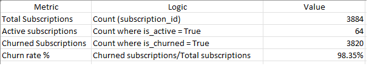
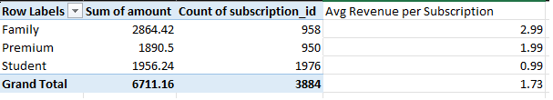
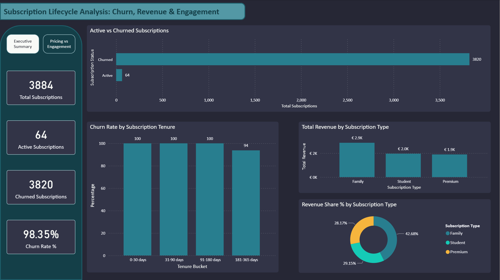
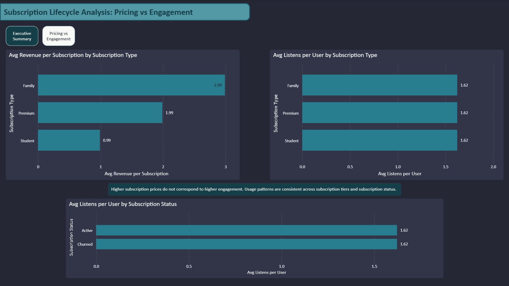

# Subscription_Lifecycle_Analysis
End-to-end subscription lifecycle analysis using SQL, Excel, and Power BI, focusing on churn, revenue, and user engagement.

## Project Overview
This project presents an end-to-end analysis of a subscription-based digital product, focusing on user churn, revenue distribution, and engagement behavior across the subscription lifecycle.

The analysis follows a full analytics workflow:
- Data modeling and transformations in SQL
- Metric validation and exploratory analysis in Excel
- Executive-level storytelling and insights in Power BI

Rather than maximizing the number of visuals or metrics, the project emphasizes analytical clarity, validation, and honest interpretation of results, including cases where user behavior does not differ meaningfully across segments.

## Limitations
- The dataset does not provide reliable calendar-based timestamps, limiting time-series analysis.
- Engagement metrics are simplified and may not capture qualitative differences in usage.
- The data represents a simulated environment and may not reflect real-world behavioral complexity.

## Tools Used
- SQL (PostgreSQL): data modeling and analysis
- Excel: KPI validation and exploratory analysis
- Power BI: dashboarding and executive storytelling

## Business Questions
The analysis was guided by the following core questions:

1. How severe is subscription churn, and does retention improve with longer tenure?
2. How is revenue distributed across subscription plans?
3. Do higher-priced subscription tiers exhibit higher user engagement?
4. Does user engagement meaningfully differ between active and churned subscriptions?

These questions were chosen to evaluate whether pricing, engagement, and retention are structurally aligned within the subscription model.

## Dataset Description
The dataset represents a simulated subscription platform and consists of four core tables:

- users.csv: user-level metadata
- subscriptions.csv: subscription lifecycle information (start, end, plan type)
- payments.csv: subscription payments and pricing data
- user_listening_history.csv: user engagement events

The data does not include reliable calendar-based timestamps for longitudinal time-series analysis. As a result, the analysis avoids misleading trend visualizations and focuses on lifecycle, distributional, and structural patterns instead.

## SQL Modeling & Transformations
SQL was used to clean, structure, and model the raw data into analysis-ready views.

Key steps included:
- Creating raw ingestion tables
- Standardizing data types and handling malformed fields
- Building views for subscriptions, payments, and engagement
- Deriving churn and lifecycle indicators
- Preparing BI-ready views for downstream tools

SQL logic is organized into:
- setup.sql: schema creation, raw tables, and core views

Some examples of schema creation, raw dataset ingestion, and view creation:
```sql
CREATE SCHEMA IF NOT EXISTS sub_metrics;
SET search_path = sub_metrics, public;

DROP TABLE IF EXISTS sub_metrics.subscriptions_raw;
CREATE TABLE sub_metrics.subscriptions_raw (
  row_id TEXT,
  subscription_id TEXT,
  user_id TEXT,
  subscription_type TEXT,
  start_date TEXT,
  end_date TEXT,
  created_at TEXT
);

/*Removing headers after ingestion*/
DELETE FROM sub_metrics.subscriptions_raw
WHERE subscription_id = 'subscription_id';
```

Core transformation of raw data example:
```sql
CREATE OR REPLACE VIEW sub_metrics.fct_subscriptions AS
SELECT
  row_id,
  subscription_id::int AS subscription_id,
  user_id::int AS user_id,
  subscription_type,
  TO_DATE(start_date, 'DD-MM-YYYY') AS start_date,
  CASE 
    WHEN end_date = 'NULL' THEN NULL
    ELSE TO_DATE(end_date, 'DD-MM-YYYY')
  END AS end_date,
  created_at
FROM sub_metrics.subscriptions_raw;
```

Creating the appropriate BI-ready views and bucket calculations:
```sql
CREATE OR REPLACE VIEW sub_metrics.bi_subscriptions AS
SELECT
  s.subscription_id,
  s.user_id,
  s.subscription_type,
  s.start_date,
  s.end_date,
/* Active and churned status based on current date */
  (s.start_date <= CURRENT_DATE AND (s.end_date IS NULL OR s.end_date >= CURRENT_DATE)) AS is_active,
  (s.end_date IS NOT NULL AND s.end_date < CURRENT_DATE) AS is_churned,
/* Tenure calculation in days */
  CASE
    WHEN s.start_date IS NULL THEN NULL
    WHEN s.end_date IS NULL OR s.end_date >= CURRENT_DATE THEN (CURRENT_DATE - start_date)
    ELSE (s.end_date - start_date)
    END AS tenure_days,
/* Tenure buckets */
  CASE
    WHEN s.start_date IS NULL THEN NULL
    WHEN (CASE
      WHEN s.end_date IS NULL OR s.end_date >= CURRENT_DATE THEN (CURRENT_DATE - start_date)
      ELSE (s.end_date - s.start_date)
    END) <= 30 THEN '0-30 days'
```

Categorising churn by the associated tenures:
```sql
CREATE OR REPLACE VIEW sub_metrics.bi_churn_tenure AS
SELECT
  tenure_bucket,
  COUNT(*) AS total_subscriptions,
  COUNT(*) FILTER (WHERE is_churned) AS churned_subscriptions,
  ROUND(COUNT(*) FILTER (WHERE is_churned)::numeric / NULLIF(COUNT(*), 0) * 100, 2) AS churn_rate_percent
FROM sub_metrics.bi_subscriptions
WHERE tenure_bucket IS NOT NULL
GROUP BY tenure_bucket
ORDER BY MIN(tenure_days);
```


- metrics.sql: analytical queries and metric exploration

Some examples are:
Revenue distribution by subscription plan:
```sql
SELECT
    s.subscription_type,
    ROUND(SUM(p.amount), 2) AS revenue,
    ROUND(SUM(p.amount) / SUM(SUM(p.amount)) OVER() * 100, 2) AS revenue_share_percent
FROM sub_metrics.fct_payments p
JOIN sub_metrics.fct_subscriptions s
    ON s.subscription_id = p.subscription_id
GROUP BY s.subscription_type
ORDER BY revenue DESC;
```

Active and churn rates by subscription plan:
```sql
SELECT
    subscription_type,
    ROUND(COUNT(*) FILTER (WHERE end_date IS NULL OR end_date >= CURRENT_DATE)::decimal / COUNT(*) * 100, 2) AS active_rate_percent,
    ROUND(COUNT(*) FILTER (WHERE end_date IS NOT NULL AND end_date < CURRENT_DATE)::decimal / COUNT(*) * 100, 2) AS churn_rate_percent
FROM sub_metrics.fct_subscriptions
GROUP BY subscription_type
ORDER BY subscription_type;
```

Engagement comparison between active and churned subscriptions:
```sql
SELECT
    CASE
        WHEN s.end_date IS NULL OR s.end_date >= CURRENT_DATE 
            THEN 'Active'
        ELSE 'Churned'
    END AS subscription_status,
    COUNT(DISTINCT e.user_id) AS users,
    ROUND(AVG(e.total_listens), 2) AS avg_listens,
    MAX(e.total_listens) AS max_listens
FROM sub_metrics.engagement_per_user e
JOIN sub_metrics.fct_subscriptions s
    ON e.user_id = s.user_id
GROUP BY subscription_status
```

## Excel Analysis
Excel was used as an analytical validation layer rather than a visualization tool. This step ensures that insights are not dependent on BI tooling alone and can be independently verified.

The Excel workbook includes:
- Manual reconstruction of core KPIs (total subscriptions, churn rate, revenue)
- Pivot-based revenue validation by subscription plan
- Lifecycle exploration of churn distribution across tenure buckets




All key dashboard metrics were recomputed using formulas and pivot tables to ensure consistency with SQL and Power BI outputs.

## Power BI Dashboard
The Power BI report is structured as a two-page narrative:

### Executive Summary
- Subscription churn severity and retention patterns
- Revenue distribution by subscription plan
- Lifecycle churn behavior across tenure buckets




### Pricing vs Engagement
- Average revenue per subscription by plan
- Average engagement by subscription plan
- Engagement comparison between active and churned subscriptions




Key insights are explicitly annotated to avoid overinterpretation of flat or non-differentiated results.

## Key Findings
- Subscription churn is extremely high and remains consistent across lifecycle stages.
- Revenue differences are driven by pricing tiers rather than user engagement.
- User engagement levels are nearly identical across subscription plans.
- Engagement does not meaningfully differ between active and churned subscriptions.

Overall, the analysis suggests a structural disconnect between pricing, usage, and retention within the subscription model.

## Potential Next Steps
- Incorporate cohort-based retention analysis with reliable time data
- Expand engagement metrics beyond raw event counts
- Explore pricing elasticity through experimental or segmented data

